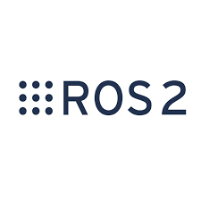

  

###

  

###

<h1 align="center">hey there 👋</h1>

###

<h3 align="left">👩‍💻  About Me</h3>

###

I'm Leonardo Brighenti from Italy  - 🔭 I’m a student worker, currently part-time  as industrial programmer - 📚 I'm currently studying Digital Automation Engineering - ⚡ In my free time I develop Rover with <a href="https://github.com/Projectredunimore">ProjectRed</a> 

---

###

<h3 align="left">🛠 Language and tools</h3>

###

  
  
  
  
  
  
  
  
  
  
  
  
  

###

<h3 align="left">🔥   My Stats :</h3>

###

  

###

---

<h3 align="left">📦 Repos:</h3>

- **[Datathon-forecast](https://github.com/leonardosos/Datathon_forecast)**: _Python, Data Science, machine learning_ — Datathon winner solution of financial forecasting.

- **[3D_Printer_Lab](https://github.com/leonardosos/3D_Printer_Lab)**: _Python, IoT, GitHub Collaboration, Microservices Architecture (Docker)_ — Distributed IoT system, web dashboard, and system design.

- **[DistributedControlProject](https://github.com/leonardosos/DistributedControlProject)**: _Python, Distributed algorithms, custom GUI_ — Fleet control platform with real-time distributed processing.

- **[High_performance_computing](https://github.com/leonardosos/High_performance_computing)**: _Python, MPI protocol, cluster job submission_ — Advanced physical analysis using parallel computing on clusters.

- **[technoform4_0](https://github.com/leonardosos/technoform4_0)**: _Python, Docker, Data analytics_ — Industry 4.0: containerizated software for data collector, analyse and web report. (work in progress)

- **[Traveling-salesman-problem](https://github.com/leonardosos/Traveling-salesman-problem)**: _Jupyter Notebook, Optimization, Heuristics_ — Heuristic and optimization approaches for the Traveling Salesman Problem with time windows.

- **[Air_filter_forecast](https://github.com/leonardosos/Air_filter_forecast)**: _Python Jupyter Notebook, Time Series forecast, Machine Learning_ — CO₂ forecasting using real air sensor data.

- **[SpectroBearingsCNN](https://github.com/leonardosos/SpectroBearingsCNN)**: _Jupyter Notebook, CNN, deep learning, Signal Processing_ — Convolutional neural network for vibration classification and predictive maintenance.
